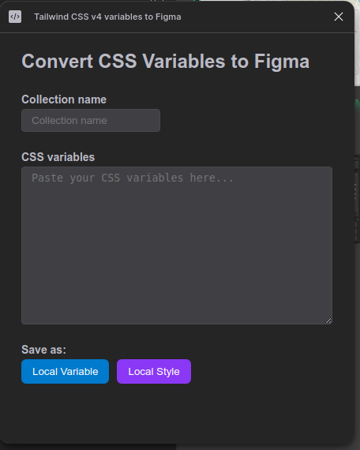
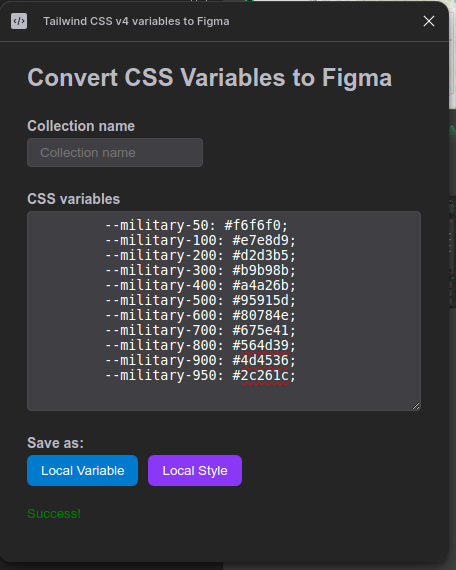

# Tailwind CSS v4 variables to Figma

A Figma plugin that allows to input CSS variables in Tailwind v4 format and introduces the feature to import them in Figma as **Local Variables** or **Local Styles**.

## Current Stage

This plugin supports formats:

* **HEX**
* **RGBA**
* **RGB**

## Usage

### Local Variables

If you choose to import the CSS variables as **Local Variables** you should fill the "Collection Name" input field in order to give a name of the collection where the variables will be stored.

If a collection with this name exists it will append or override the inported variables to the collection.

The CSS variables are entered in the big textbox "CSS Variables"

### Local Styles

If you choose to import the CSS variables as **Local Styles** it is only required to fill the "CSS Variables" textbox

If there are styles that already exist they will be overriden.

## Screenshots

